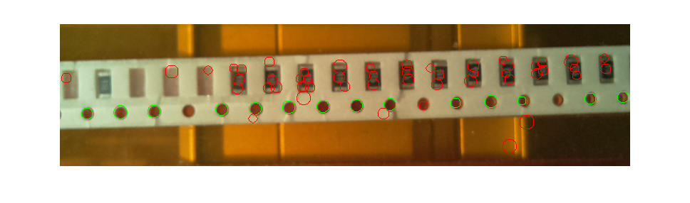

# circles -> **RANSAC -> line -> least-squares** -> resolution
Determine the px/mm resolution of the image from a smt tape (4mm separation of holes).

The input to this stage are points (e.g. detected by the [[op HoughCircles]] stage).

This stage is not yet implemented in FireSight, this page only documents the idea. The current implementation is in MATLAB.

## Principle

The Hough circles detector is not perfect and often produces some false negatives and false positives. We know that the holes in the tape form a line, thus a [RANSAC](https://en.wikipedia.org/wiki/RANSAC) is employed to detect the line from all the circles. This gives a somewhat robust estimate of the line position. The line is fitted to the inliers (returned by RANSAC) by least-squares. Next, regularly spaced points on the line are found by second application of RANSAC with a different error measure. Finally, the median of distances of neighbouring points determines the resolution.

Sample json pipeline is given in the following code snippet. The output of HoughCircles stage is passed to points2resolution_RANSAC stage. The separation of holes in the smt tape is 4mm, which is set by the 'separation' variable.

<pre>
[
  {"op":"HoughCircles", "name":"circles", "diamMin":14.0, "diamMax":20.0, "show":1},
  {"op":"points2resolution_RANSAC", "name":"p2r_RANSAC", "model":"circles", "separation":4.0}
]
</pre>

In the images, all circles (red and green) are the output of the HoughCircles stage. The green ones are the inliers found by RANSAC.

The next step is to determine the distance (in pixels) of the holes' centres. For this a [median](https://en.wikipedia.org/wiki/Median) of distances of neighbouring circles is used.

### horizontal line
* true resolution: 11.77 px/mm
* estimated resolution: 11.74 px/mm

### vertical line
* true resolution: 12.05 px/mm
* estimated resolution: 12.24 px/mm
