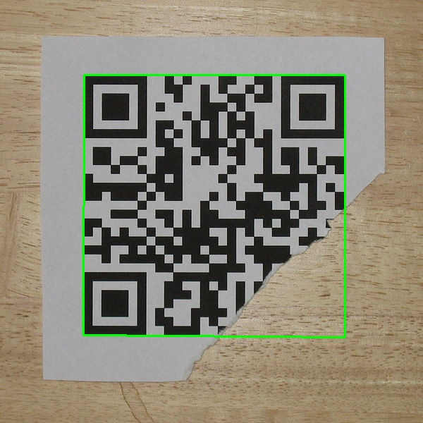

Detect and decode text QR codes.

This stage uses the zbar library (http://zbar.sourceforge.net/).

#### Pipeline
<pre> {"op":"qrDecode", "show":1}</pre>
* **show** update working image and
 `0`:do not show detected QR codes; 
 `1`:show boundaries of detected QR codes; 

#### Example: Wiki Ripper [pipeline](https://github.com/firepick1/FireSight/blob/master/json/qrDecode.json)

The output of the stage is an array of qr code center coordinates and decoded text. If the qr code is not decoded (or not present in the image), both the coordinates default to -1.

Running the following command
<pre>firesight -p json/qrDecode.json -i 600px-QR_Code_Damaged.jpg -o qr-damaged-result.jpg</pre>
on an <a href=https://en.wikipedia.org/wiki/File:QR_Code_Damaged.jpg>image</a> taken from Wikipedia yields the following results:
<pre>{
  "s1":{
    "qrdata":[
      {
        "x":304.0,
        "y":292.0,
        "text":"http://en.m.wikipedia.org"
      }
    ]
  }
}</pre>

#### Example: A tiny git [pipeline](https://github.com/firepick1/FireSight/blob/master/json/qrDecode.json)
<pre>firesight -p json/qrDecode.json -i img/qr-tiny.jpg -o target/qr-tiny.png</pre>
Here's a tiny, not quite rectangular QRCode with a git commit hash
on an <a href=https://en.wikipedia.org/wiki/File:QR_Code_Damaged.jpg>image</a> taken from Wikipedia yields the following results:

<pre>{
"s1":{
  "qrdata":[
      {
	"x":87.5,
	"y":117.0,
	"text":"29bf4b2f6036895011510c29da08d9d9fe097fd4"
      }
    ]
  }
}</pre>

