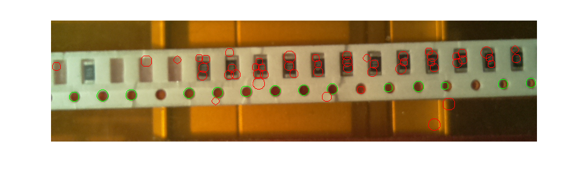
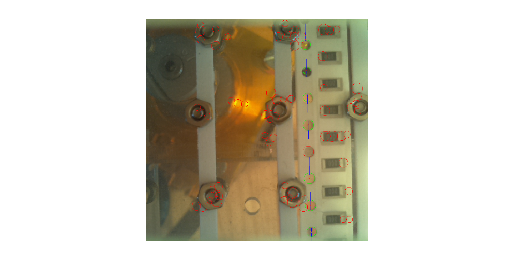

Determine the px/mm resolution of the image from a smt tape (4mm separation of holes).

The input to this stage are circles, detected by the [[op HoughCircles]] stage.

This stage is not yet implemented in FireSight, this page only documents the idea. The current implementation is in MATLAB.

#### Principle

The Hough circles detector is not perfect and often produces some false negatives and false positives. We know that the holes in the tape form a line, thus a [RANSAC](https://en.wikipedia.org/wiki/RANSAC) is employed to detect the line from all the circles. This gives a somewhat robust estimate of the line position.

The next step is to determine the distance (in pixels) of the holes' centres. For this a [median](https://en.wikipedia.org/wiki/Median) is used.

##### horizontal line
true resolution: 11.77 px/mm
estimated resolution: 11.74 px/mm

##### vertical line
true resolution: 12.05 px/mm
estimated resolution: 12.24 px/mm
