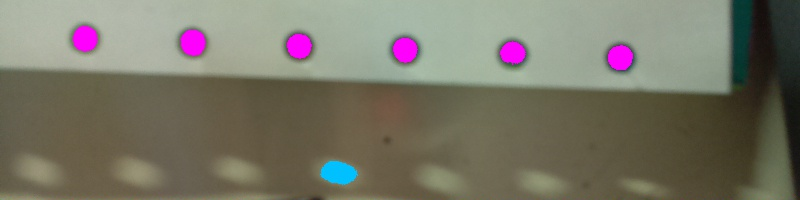

Recognize holes(s) of given range in diameter within image using amended [MSER](http://docs.opencv.org/modules/features2d/doc/feature_detection_and_description.html#mser) algorithm.

#### Pipeline
<pre> {"op":"HoleRecognizer", "diamMin":22.6, "diamMax":29.9, "show":1}</pre>
* **diamMin** minimum diameter in pixels
* **diamMax** maximum diameter in pixels
* **show** update working image and 
 `0`:do not show recognized holes; 
 `1`:show MSER hole candidates (see below); 
 `2`:show matched holes only (fuchsia)

#### Model
<pre>
    "holes":[
      {
        "xmin":608,
        "xmax":632,
        "xavg":619.8985595703125,
        "ymin":45,
        "ymax":69,
        "yavg":57.265720367431641,
        "pts":493,
        "ellipse":490.87387084960938,
        "covar":0.671875
      },
      {
        "xmin":180,
        "xmax":205,
        "xavg":192.58755493164062,
        "ymin":30,
        "ymax":55,
        "yavg":42.214008331298828,
        "pts":514,
        "ellipse":530.92919921875,
        "covar":1.3974609375
      }
    ]
</pre>
* **holes** array of JSON objects. each describing a matched hole
* **xmin** minimum x-pixel value of hole
* **xmax** maximum x-pixel value of hole
* **xavg** average x-pixel value of hole
* **ymin** minimum y-pixel value of hole
* **ymax** maximum y-pixel value of hole
* **yavg** average y-pixel value of hole
* **pts** pixel area of hole (point in MSER region)
* **ellipse** area of ellipse covering [xmin, xmax] and [ymin, ymax]
* **covar** [covariance](http://en.wikipedia.org/wiki/Covariance) of point coordinates (used to measure "centered-ness")

#### Example
<pre>firesight -i img/cam.jpg -p json/HoleRecognizer.json</pre>
Output image `target/HoleRecognizer.jpg`

#### See Also
* [[op: SimpleBlobDetector]]